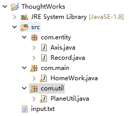
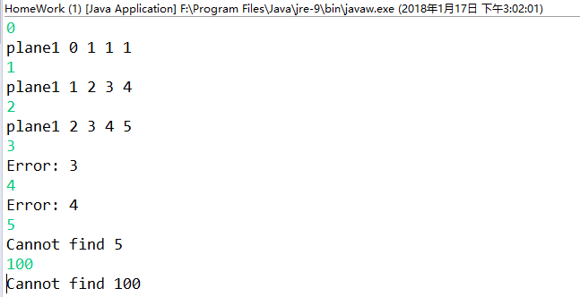

# ThoughtWorks HomeWork


## 1. 项目结构
)
#### 1.1结构说明
- com.entity：普通Java类包
Axis：坐标类
Record：飞机状态记录类
- com.util：工具类包
PlaneUtil：无人机相关操作的工具类
- com.main:程序主类包
HomeWork：主类
- input.txt：输入文件
## 2. 功能测试
输入:
```
plane1 1 1 1
plane1 1 1 1 1 2 3
plane1 2 3 4 1 1 1
plane1 3 4 5
plane1 1 1 1 1 2 3
```
输出结果：
